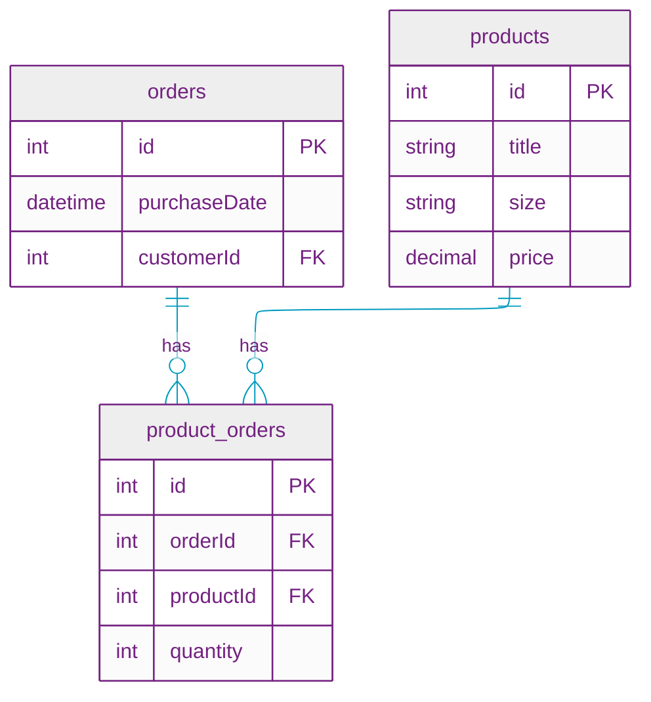

# Entity Relation Diagram (ERD) db-for-api.json

```mermaid
%%{init:{"securityLevel":"loose","layout":"elk","elk":{"nodePlacementStrategy":"NETWORK_SIMPLEX"},"theme":"base",
"themeVariables":{"primaryColor":"#EEE","primaryTextColor":"#732181","primaryBorderColor":"#732181","lineColor":"#009ABE","noteBorderColor":"#732181","noteBkgColor":"#F38A00","activationBkgColor":"#F38A00"    }
}}%%
%%----------------------- MERMAID MARKUP BELOW --------------------%%
erDiagram
    orders {
      int id PK
      datetime purchaseDate
      int customerId FK
    }

    products {
      int id PK
      string title
      string size 
      decimal price
    }


    product_orders{
      int id PK
      int orderId FK
      int productId FK
      int quantity
    }

    %% Relationships
    orders ||--o{ product_orders : "has"
    products ||--o{ product_orders : "has"


%%----------------------- MERMAID MARKUP ABOVE --------------------%%    
```
NOTE: orders has a customerId which implys a customer entity (but that is outside of example scope)