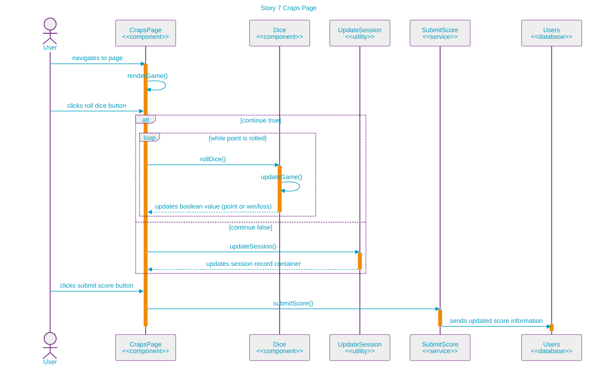

# Sequence Diagram : User plays Craps game

```mermaid
%%{init:{"securityLevel":"loose","layout":"elk","elk":{"nodePlacementStrategy":"NETWORK_SIMPLEX"},"theme":"base",
"themeVariables":{"primaryColor":"#EEE","primaryTextColor":"#009ABE","primaryBorderColor":"#732181","lineColor":"#009ABE","noteBorderColor":"#732181","noteBkgColor":"#F38A00","activationBkgColor":"#F38A00"    }
}}%%
%%----------------------- MERMAID MARKUP BELOW --------------------%%


sequenceDiagram
title: Story 7 Craps Page

    actor u as User
    participant craps as CrapsPage<br><<component>>
    participant dice as Dice<br><<component>>
    participant ups as UpdateSession<br><<utility>>
    participant ss as SubmitScore<br><<service>>
    participant js as Users<br><<database>>

    u->>craps: navigates to page
    activate craps

    craps->>craps: renderGame()
    u->>craps: clicks roll dice button

    alt continue true
        loop while point is rolled
            craps->>dice: rollDice()
            activate dice
            dice->>dice: updateGame()
            dice-->>craps: updates boolean value (point or win/loss)
            deactivate dice
    end

    else continue false
        craps->>ups: updateSession()
        activate ups
        ups-->>craps: updates session record container
        deactivate ups
    end

    u->>craps: clicks submit score button
    craps->>ss: submitScore()
    activate ss
    ss->>js: sends updated score information
    activate js
    deactivate js
    deactivate ss
    deactivate craps

%%----------------------- MERMAID MARKUP ABOVE --------------------%%
```
