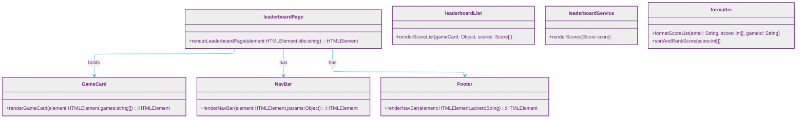

```mermaid
%%{init:{"securityLevel":"loose","layout":"elk","elk":{"nodePlacementStrategy":"NETWORK_SIMPLEX"},"theme":"base",
"themeVariables":{"primaryColor":"#EEE","primaryTextColor":"#732181","primaryBorderColor":"#732181","lineColor":"#009ABE","noteBorderColor":"#732181","noteBkgColor":"#F38A00","activationBkgColor":"#F38A00"    }
}}%%
%%----------------------- MERMAID MARKUP BELOW --------------------%%
classDiagram
%%  direction LR

    
    class leaderboardPage{
        +renderLeaderboardPage(element:HTMLElement,title:string):HTMLElement
        
    }
    class GameCard {
        +renderGameCard(element:HTMLElement,games:string[]):HTMLElement
    }

    class leaderboardList{
        +renderScoreList(gameCard: Object, scores: Score[])
    }

    class leaderboardService{
        +renderScores(Score score)
    }

    class formatter{
        +formatScoreList(email: String, score: int[], gameId: String)
        +sortAndRankScore(score:int[])
    }

    class NavBar {
        +renderNavBar(element:HTMLElement,params:Object):HTMLElement
    }

    class Footer {
        +renderNavBar(element:HTMLElement,advert:String):HTMLElement
    }

    %% Relationships
    leaderboardPage --> GameCard : holds
    leaderboardPage --> NavBar : has
    leaderboardPage --> Footer : has


%%----------------------- MERMAID MARKUP ABOVE --------------------%%
```
