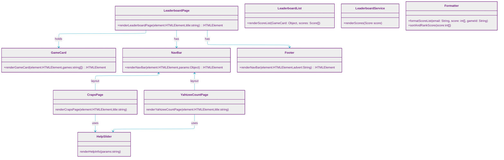

```mermaid
%%{init:{"securityLevel":"loose","layout":"elk","elk":{"nodePlacementStrategy":"NETWORK_SIMPLEX"},"theme":"base",
"themeVariables":{"primaryColor":"#EEE","primaryTextColor":"#732181","primaryBorderColor":"#732181","lineColor":"#009ABE","noteBorderColor":"#732181","noteBkgColor":"#F38A00","activationBkgColor":"#F38A00"    }
}}%%
%%----------------------- MERMAID MARKUP BELOW --------------------%%
classDiagram
%%  direction LR

    
    class LeaderboardPage{
        +renderLeaderboardPage(element:HTMLElement,title:string):HTMLElement
        
    }
    class GameCard {
        +renderGameCard(element:HTMLElement,games:string[]):HTMLElement
    }

    class LeaderboardList{
        +renderScoreList(GameCard: Object, scores: Score[])
    }

    class LeaderboardService{
        +renderScores(Score score)
    }

    class Formatter{
        +formatScoreList(email: String, score: int[], gameId: String)
        +sortAndRankScore(score:int[])
    }

    class NavBar {
        +renderNavBar(element:HTMLElement,params:Object):HTMLElement
    }

    class Footer {
        +renderNavBar(element:HTMLElement,advert:String):HTMLElement
    }
    class CrapsPage {
        renderCrapsPage(element:HTMLElement,title:string)
    }
    class YahtzeeCountPage {
        renderYahtzeeCountPage(element:HTMLElement,title:string)
    }
    class HelpSlider {
        renderHelpInfo(params:string)
    }

    %% Relationships
    LeaderboardPage --> GameCard : holds
    LeaderboardPage --> NavBar : has
    LeaderboardPage --> Footer : has
    NavBar <-- CrapsPage : layout
    NavBar <-- YahtzeeCountPage : layout
    YahtzeeCountPage --> HelpSlider: uses
    CrapsPage --> HelpSlider: uses

%%----------------------- MERMAID MARKUP ABOVE --------------------%%
```