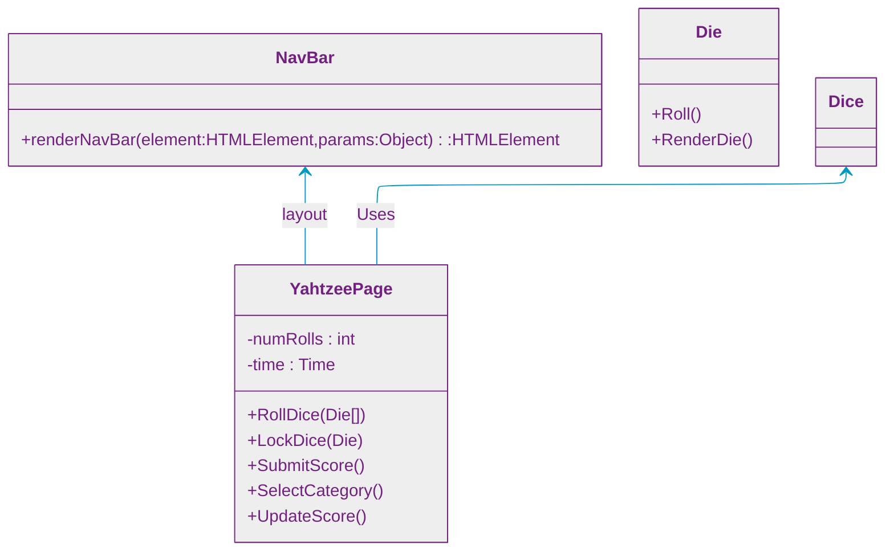

# UML Class Diagram for Yahtzee Count Page

```mermaid
%%{init:{"securityLevel":"loose","layout":"elk","elk":{"nodePlacementStrategy":"NETWORK_SIMPLEX"},"theme":"base",
"themeVariables":{"primaryColor":"#EEE","primaryTextColor":"#732181","primaryBorderColor":"#732181","lineColor":"#009ABE","noteBorderColor":"#732181","noteBkgColor":"#F38A00","activationBkgColor":"#F38A00"    }
}}%%
%%----------------------- MERMAID MARKUP BELOW --------------------%%
classDiagram
%%  direction LR

    class NavBar {
        +renderNavBar(element:HTMLElement,params:Object):HTMLElement
    }

    class Die {
        +Roll()
        +RenderDie()
    }

    class YahtzeePage {

        -numRolls : int
        -time : Time
        +RollDice(Die[])
        +LockDice(Die)
        +SubmitScore()
        +SelectCategory()
        +UpdateScore()
    }

    %% Relationships
    NavBar <-- YahtzeePage : layout
    Dice <-- YahtzeePage : Uses


%%----------------------- MERMAID MARKUP ABOVE --------------------%%
```
