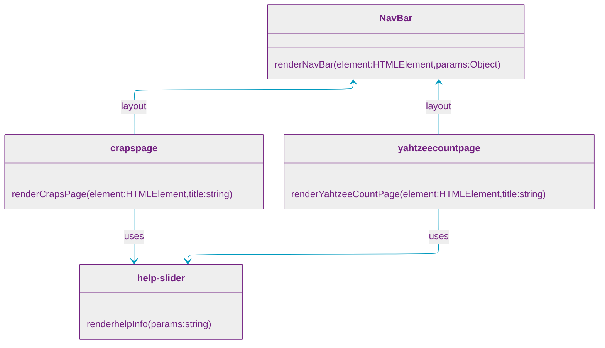

# UML Class Diagram for Examples

```mermaid
%%{init:{"securityLevel":"loose","layout":"elk","elk":{"nodePlacementStrategy":"NETWORK_SIMPLEX"},"theme":"base",
"themeVariables":{"primaryColor":"#EEE","primaryTextColor":"#732181","primaryBorderColor":"#732181","lineColor":"#009ABE","noteBorderColor":"#732181","noteBkgColor":"#F38A00","activationBkgColor":"#F38A00"    }
}}%%
%%----------------------- MERMAID MARKUP BELOW --------------------%%
classDiagram
%%  direction LR

    class crapspage {
        renderCrapsPage(element:HTMLElement,title:string)
    }
    class yahtzeecountpage {
        renderYahtzeeCountPage(element:HTMLElement,title:string)
    }
    class NavBar {
        renderNavBar(element:HTMLElement,params:Object)
    }
    class help-slider {
        renderhelpInfo(params:string)
    }

    %% Relationships
        NavBar <-- crapspage : layout
        NavBar <-- yahtzeecountpage : layout
        yahtzeecountpage --> help-slider: uses
        crapspage --> help-slider: uses
    


%%----------------------- MERMAID MARKUP ABOVE --------------------%%    
```