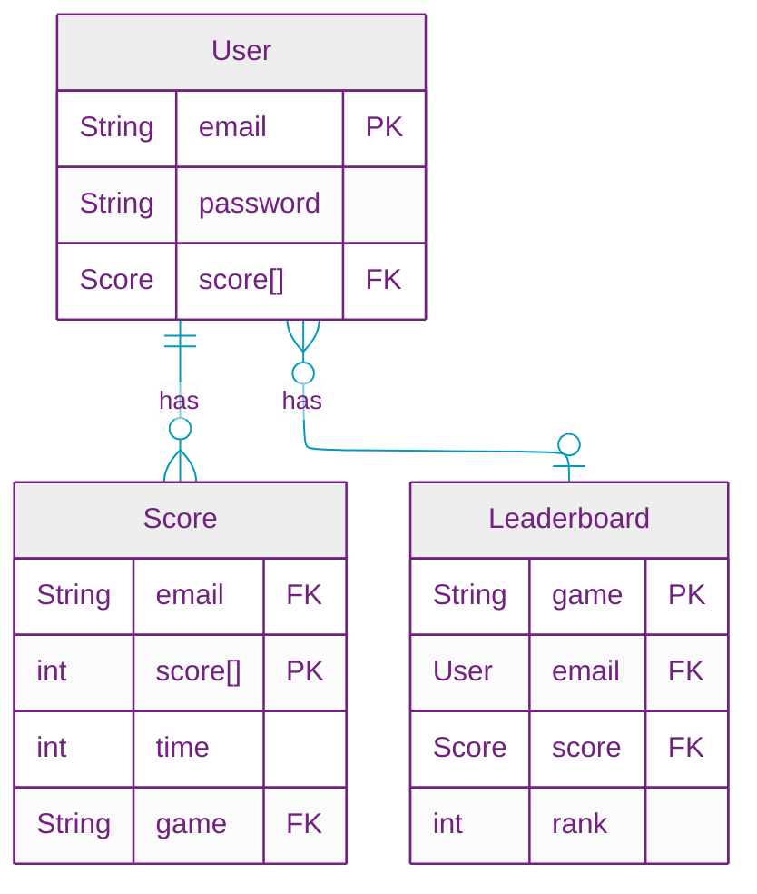

# Entity Relation Diagram (ERD) db-for-api.json

```mermaid
%%{init:{"securityLevel":"loose","layout":"elk","elk":{"nodePlacementStrategy":"NETWORK_SIMPLEX"},"theme":"base",
"themeVariables":{"primaryColor":"#EEE","primaryTextColor":"#732181","primaryBorderColor":"#732181","lineColor":"#009ABE","noteBorderColor":"#732181","noteBkgColor":"#F38A00","activationBkgColor":"#F38A00"    }
}}%%
%%----------------------- MERMAID MARKUP BELOW --------------------%%
erDiagram
    Score {
      String email FK
      int score[] PK
      int time
      String game FK
    }

    Leaderboard {
      String game PK
      User email FK
      Score score FK
      int rank
    }

    User{
        String email PK
        String password
        Score score[] FK
    }


    %% Relationships
    User }o--o| Leaderboard : "has"
    User ||--o{ Score : "has"


%%----------------------- MERMAID MARKUP ABOVE --------------------%%
```

NOTE: we haven't made any notes
