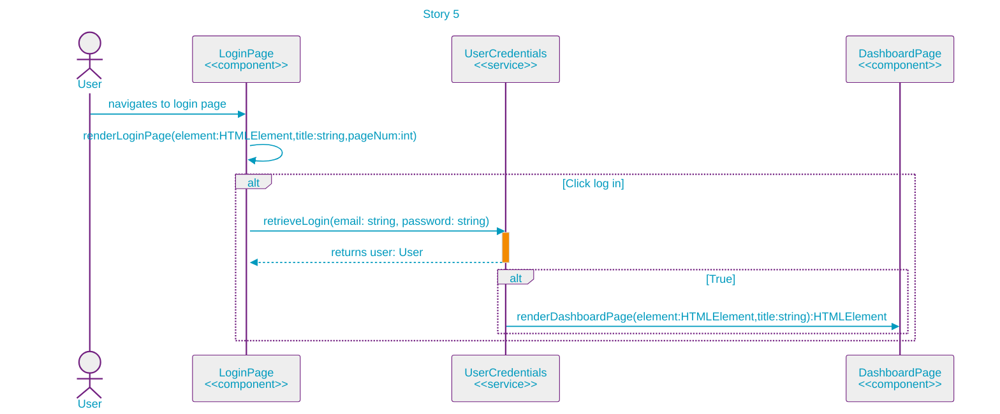

# Simplified Sequence Diagram  : Shopper views a list of products

```mermaid
%%{init:{"securityLevel":"loose","layout":"elk","elk":{"nodePlacementStrategy":"NETWORK_SIMPLEX"},"theme":"base",
"themeVariables":{"primaryColor":"#EEE","primaryTextColor":"#009ABE","primaryBorderColor":"#732181","lineColor":"#009ABE","noteBorderColor":"#732181","noteBkgColor":"#F38A00","activationBkgColor":"#F38A00"    }
}}%%
%%----------------------- MERMAID MARKUP BELOW --------------------%%


sequenceDiagram
title: Story 5

    actor u as User
    participant l as LoginPage<br><<component>>
    participant c as UserCredentials<br><<service>>
    participant d as DashboardPage<br><<component>>
    

    u->>l: navigates to login page
    activate l
    l->>l: renderLoginPage(element:HTMLElement,title:string,pageNum:int)
    alt Click log in
        l->>c: retrieveLogin(email: string, password: string)
        activate c
        c-->>l: returns user: User
        deactivate c
        alt True
            c->>d: renderDashboardPage(element:HTMLElement,title:string):HTMLElement
        end
    end


%%----------------------- MERMAID MARKUP ABOVE --------------------%%
```
