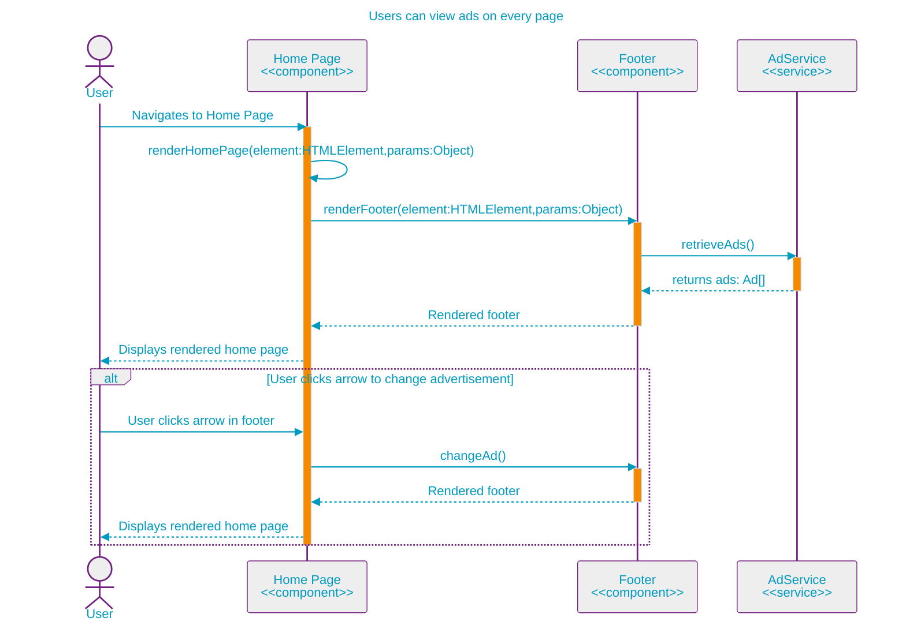

# story10_as_a_user_i_want_to_interact_with_the_website_via_a_dashboard_page,_navigation_menu_and_see_a_footer_that_displays_ads

```mermaid
%%{init:{"securityLevel":"loose","layout":"elk","elk":{"nodePlacementStrategy":"NETWORK_SIMPLEX"},"theme":"base",
"themeVariables":{"primaryColor":"#EEE","primaryTextColor":"#009ABE","primaryBorderColor":"#732181","lineColor":"#009ABE","noteBorderColor":"#732181","noteBkgColor":"#F38A00","activationBkgColor":"#F38A00"    }
}}%%
%%----------------------- MERMAID MARKUP BELOW --------------------%%


sequenceDiagram
title: Users can view ads on every page

    actor u as User
    participant h as Home Page<br><<component>>
    participant a as Footer<br><<component>>
    participant s as AdService<br><<service>>

    u->>h: Navigates to Home Page
    activate h
        h ->> h: renderHomePage(element:HTMLElement,params:Object)
        h ->> a: renderFooter(element:HTMLElement,params:Object)
        activate a
            a ->> s: retrieveAds()
            activate s
                s -->> a: returns ads: Ad[]
            deactivate s
            a -->> h: Rendered footer
        deactivate a
        h -->> u: Displays rendered home page
        alt User clicks arrow to change advertisement
            u ->> h: User clicks arrow in footer
            h ->> a: changeAd()
            activate a
            a -->> h: Rendered footer
            deactivate a
            h -->> u: Displays rendered home page
        end
    deactivate h


%%----------------------- MERMAID MARKUP ABOVE --------------------%%
```