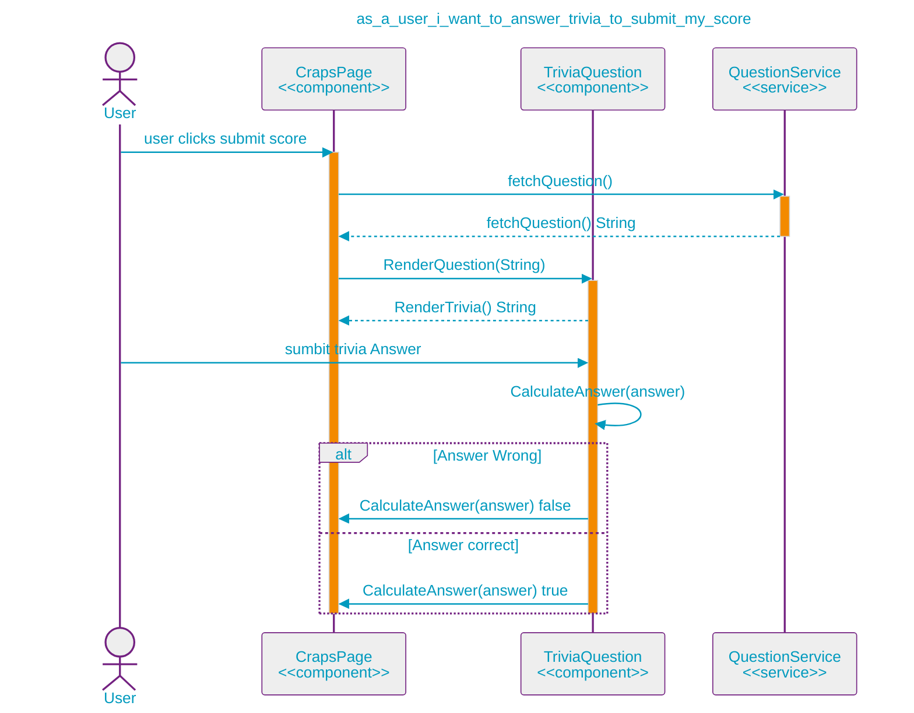

# story11_as_a_user_i_want_to_answer_trivia_to_submit_my_score

```mermaid
%%{init:{"securityLevel":"loose","layout":"elk","elk":{"nodePlacementStrategy":"NETWORK_SIMPLEX"},"theme":"base",
"themeVariables":{"primaryColor":"#EEE","primaryTextColor":"#009ABE","primaryBorderColor":"#732181","lineColor":"#009ABE","noteBorderColor":"#732181","noteBkgColor":"#F38A00","activationBkgColor":"#F38A00"    }
}}%%
%%----------------------- MERMAID MARKUP BELOW --------------------%%


sequenceDiagram
title: as_a_user_i_want_to_answer_trivia_to_submit_my_score

    actor u as User
    participant g as CrapsPage<br><<component>>
    participant t as TriviaQuestion<br><<component>>
    participant qs as QuestionService<br><<service>>

    u->>g: user clicks submit score
    activate g
    g->>qs: fetchQuestion()
    activate qs
    qs-->>g: fetchQuestion() String
    deactivate qs
    g ->>t: RenderQuestion(String)
    activate t

    t-->>g: RenderTrivia() String
    u->>t: sumbit trivia Answer
    t->>t: CalculateAnswer(answer)
    alt Answer Wrong
        t->>g: CalculateAnswer(answer) false
        else Answer correct
        t->>g: CalculateAnswer(answer) true
    end
    deactivate t
    deactivate g

%%----------------------- MERMAID MARKUP ABOVE --------------------%%
```