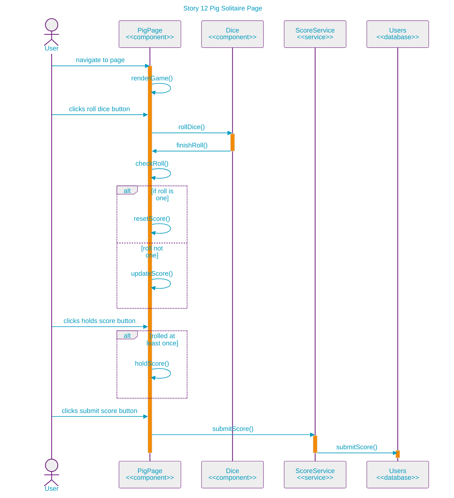

# Sequence Diagram : User plays pig game

```mermaid
%%{init:{"securityLevel":"loose","layout":"elk","elk":{"nodePlacementStrategy":"NETWORK_SIMPLEX"},"theme":"base",
"themeVariables":{"primaryColor":"#EEE","primaryTextColor":"#009ABE","primaryBorderColor":"#732181","lineColor":"#009ABE","noteBorderColor":"#732181","noteBkgColor":"#F38A00","activationBkgColor":"#F38A00"    }
}}%%
%%----------------------- MERMAID MARKUP BELOW --------------------%%


sequenceDiagram
title: Story 12 Pig Solitaire Page

    actor u as User
    participant pig as PigPage<br><<component>>
    participant dice as Dice<br><<component>>
    participant ss as ScoreService<br><<service>>
    participant js as Users<br><<database>>

    u->>pig: navigate to page
    activate pig

    pig->>pig: renderGame()
    u->>pig: clicks roll dice button

    pig->>dice: rollDice()
    activate dice
    dice->>pig: finishRoll()
    deactivate dice
    pig->>pig: checkRoll()

    alt if roll is one
        pig->>pig: resetScore()

    else roll not one
        pig->>pig: updateScore()
    end

    u->>pig: clicks holds score button
    alt rolled at least once
        pig->>pig: holdScore()
    end

    u->>pig: clicks submit score button
    pig->>ss: submitScore()
    activate ss
    ss->>js: submitScore()
    activate js
    deactivate js
    deactivate ss
    deactivate pig

%%----------------------- MERMAID MARKUP ABOVE --------------------%%
```