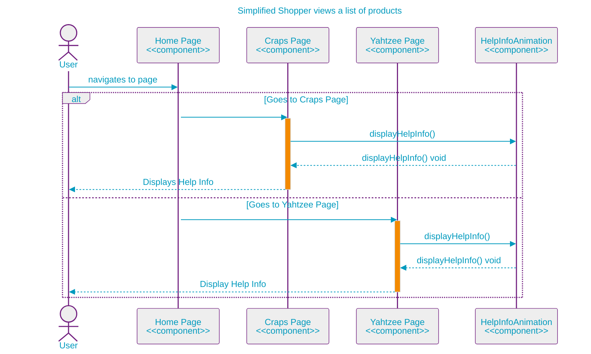

# Story 3 as_a_user_i_can_view_the_rules_of_the_game

```mermaid
%%{init:{"securityLevel":"loose","layout":"elk","elk":{"nodePlacementStrategy":"NETWORK_SIMPLEX"},"theme":"base",
"themeVariables":{"primaryColor":"#EEE","primaryTextColor":"#009ABE","primaryBorderColor":"#732181","lineColor":"#009ABE","noteBorderColor":"#732181","noteBkgColor":"#F38A00","activationBkgColor":"#F38A00"    }
}}%%
%%----------------------- MERMAID MARKUP BELOW --------------------%%


sequenceDiagram
title: Simplified Shopper views a list of products

    actor u as User
    participant p as Home Page<br><<component>>
    participant c as Craps Page<br><<component>>
    participant y as Yahtzee Page<br><<component>>
    participant h as HelpInfoAnimation<br><<component>>

    u->>p: navigates to page
    activate p
    alt Goes to Craps Page
    p->>c:
    activate c
    c->>h: displayHelpInfo()
    h-->>c: displayHelpInfo() void
    c-->>u: Displays Help Info
    deactivate c    
    else Goes to Yahtzee Page
    p->>y:
    activate y
    y->>h: displayHelpInfo()
    h-->>y: displayHelpInfo() void
    y-->>u: Display Help Info
    deactivate y
    end


%%----------------------- MERMAID MARKUP ABOVE --------------------%%
```
