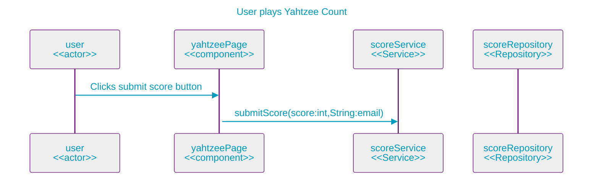

# Story 8: As a user I want to enter a score into a category

```mermaid
%%{init:{"securityLevel":"loose","layout":"elk","elk":{"nodePlacementStrategy":"NETWORK_SIMPLEX"},"theme":"base",
"themeVariables":{"primaryColor":"#EEE","primaryTextColor":"#009ABE","primaryBorderColor":"#732181","lineColor":"#009ABE","noteBorderColor":"#732181","noteBkgColor":"#F38A00","activationBkgColor":"#F38A00"    }
}}%%
%%----------------------- MERMAID MARKUP BELOW --------------------%%


sequenceDiagram
title: User plays Yahtzee Count

participant u as user<br><<actor>>
participant p as yahtzeePage<br><<component>>
participant scoreSvc as scoreService<br><<Service>>
participant scoreRepo as scoreRepository<br><<Repository>>

u->>p: Clicks submit score button
activate p

p->>scoreSvc: submitScore(score:int,String:email)


%%----------------------- MERMAID MARKUP ABOVE --------------------%%
```
