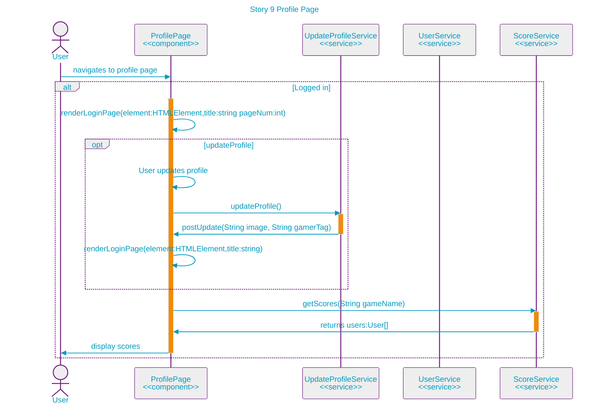

# Story 9: As a user, I want to view my profile

```mermaid
%%{init:{"securityLevel":"loose","layout":"elk","elk":{"nodePlacementStrategy":"NETWORK_SIMPLEX"},"theme":"base",
"themeVariables":{"primaryColor":"#EEE","primaryTextColor":"#009ABE","primaryBorderColor":"#732181","lineColor":"#009ABE","noteBorderColor":"#732181","noteBkgColor":"#F38A00","activationBkgColor":"#F38A00"    }
}}%%
%%----------------------- MERMAID MARKUP BELOW --------------------%%

sequenceDiagram
title: Story 9 Profile Page

    actor u as User
    participant p as ProfilePage <br><<component>>
    participant f as UpdateProfileService<br><<service>>
    participant s as UserService <br><<service>>
    participant m as ScoreService<br><<service>>
    %%participant r as RenderScore<br><<component>>


    u->>p: navigates to profile page
    alt Logged in
        activate p
            p->>p: renderLoginPage(element:HTMLElement,title:string pageNum:int)

    opt updateProfile
        p->>p: User updates profile
        p->>f: updateProfile()
        activate f
        f->>p: postUpdate(String image, String gamerTag)
        deactivate f
        p->>p: renderLoginPage(element:HTMLElement,title:string)


    end
            p->>m: getScores(String gameName)

            activate m
            m->>p: returns users:User[]
            deactivate m
            p->>u: display scores
        deactivate p
    end


%%----------------------- MERMAID MARKUP ABOVE --------------------%%
```
