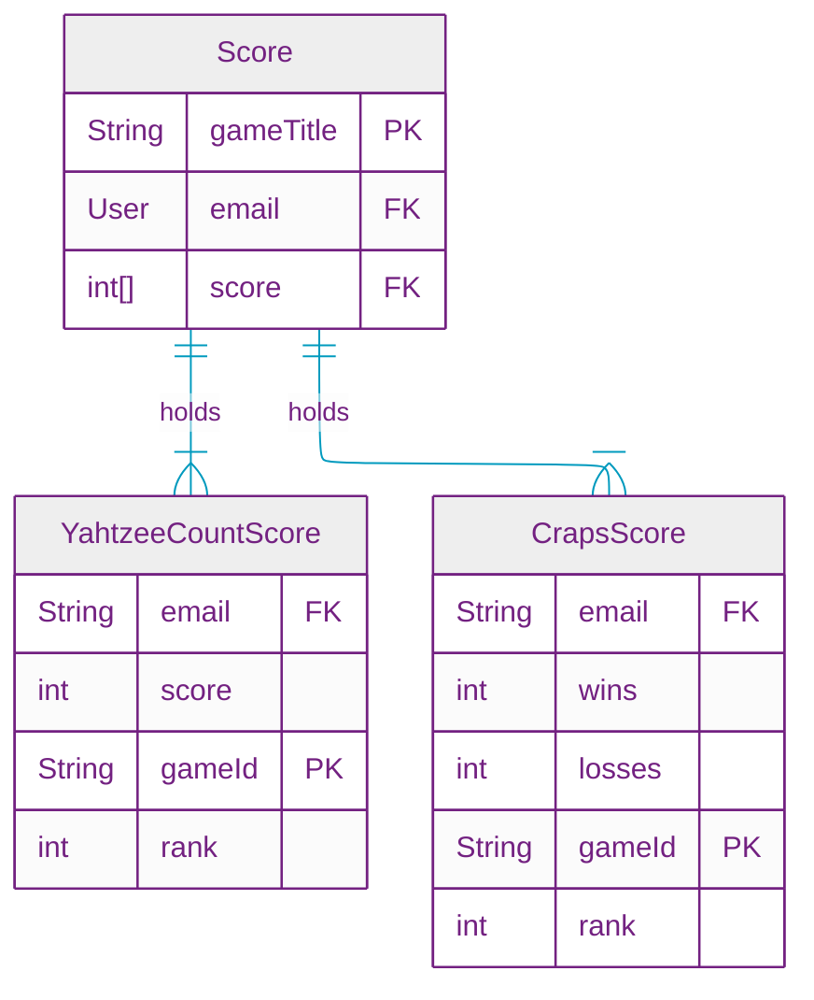

# Entity Relation Diagram (ERD) db-for-api.json

```mermaid
%%{init:{"securityLevel":"loose","layout":"elk","elk":{"nodePlacementStrategy":"NETWORK_SIMPLEX"},"theme":"base",
"themeVariables":{"primaryColor":"#EEE","primaryTextColor":"#732181","primaryBorderColor":"#732181","lineColor":"#009ABE","noteBorderColor":"#732181","noteBkgColor":"#F38A00","activationBkgColor":"#F38A00"    }
}}%%
%%----------------------- MERMAID MARKUP BELOW --------------------%%
erDiagram
    YahtzeeCountScore {
      String email FK
      int score
      String gameId PK
      int rank
    }

    CrapsScore {
      String email FK
      int wins
      int losses
      String gameId PK
      int rank
    }

    Score {
      String gameTitle PK
      User email FK
      int[] score FK
    }

    %% Relationships

    Score ||--|{ CrapsScore : "holds"
    Score ||--|{ YahtzeeCountScore : "holds"

%%----------------------- MERMAID MARKUP ABOVE --------------------%%
```

